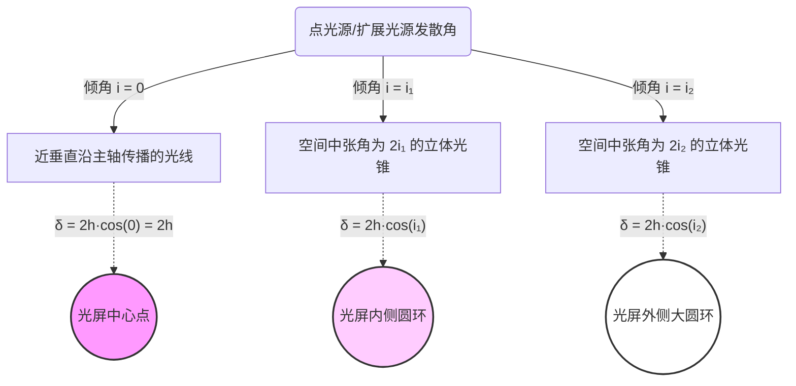

# 其他问题解答

## 1. 红光的平行条纹和圆环条纹究竟是怎么形成的，以及意味着什么？

**答：**
迈克尔逊干涉仪的干涉图样，本质上是 **M1（或其虚像）** 与固定镜 **M2经分光板所成的虚像（M2'）** 这两个面叠加在一起，构成的一层“等效空气薄膜”所产生的光学干涉现象。红光激光作为相干长度极长的单色光源，能够清晰地展示这层薄膜不同几何形态下的干涉特征。

### （一）圆环条纹（等倾干涉）

*   **物理模型示意：**
    当 M1 的像与 M2' **严格平行**，且存在一定距离 $h$ 时，构成“平板状”空气薄膜。
    ```text
    入射光 (发散光源/扩展光源)
       \   |   /  入射角 i
        \  |  /
    M1像  ======  ↑
           |      | 几何间距 h
    M2'    ======  ↓
    ```

*   **形成机制：**
    从同一个发散光源发出的不同光线，以不同倾角 $i$（入射角）射入这层平行的空气膜。反射出来的两束相干光在空间某点相遇时，其光程差 $\delta$ 完全由入射角 $i$ 决定公式为：
    $$\delta = 2h \cos(i)$$
    产生亮条纹的条件是 $\delta = k\lambda$（$k$为整数）。因为相同倾角 $i$ 的光线形成一个圆锥面，它们的光程差全相等，于是在接收屏上截出来就是一个个同心圆环。这就是**等倾干涉**。

*   **意味着什么？**
    1.  **形态对准**：意味着 M1 和 M2 （及其虚像）在空间三维角度上已经调到了**非常完美的相互平行状态（垂直正交设定准确）**。
    2.  **吞吐效应反映距离**：随着动镜位置移动（即 $h$ 变化），圆环中心的光程差 $2h$ 会改变。$h$ 增大时，圆环从中心向外“冒出”（吞吐），圆环变得越来越密；$h$ 减小时，圆环向中心收缩，直至中心明暗交替。

### （二）平行直条纹（等厚干涉）

*   **物理模型示意：**
    当 M1 的像与 M2' **不仅距离极近，而且存在微小夹角 $\theta$** 时，构成“楔形/劈尖”空气薄膜。
    ```text
    入射光 (近似垂直照射)
    |  |  |  |  
    |  |  |  |
    |  |  \======  M1像
    |  |   \       ↑ 局部厚度 h(x)
    |  |    \====  M2'
    交线处 h=0 
    ```

*   **形成机制：**
    此时厚度 $h$ 本身在各个位置都不一样，随横向坐标 $x$ 呈线性变化：$h(x) = x \cdot \theta$。
    此时光程差主要受局部厚度极剧烈变化的主导，对于近垂直入射（$i \approx 0$ 即 $\cos i \approx 1$）的光，光程差简化为：
    $$\delta \approx 2 h(x) = 2x \theta$$
    产生亮条纹的条件是 $2x\theta = k\lambda$。在此等式中，$x$ 是定值对应一条直线，即“同样厚度的地方形成同一条亮度相同的条纹”。这就是**等厚干涉**。

*   **意味着什么？**
    1.  **极距特性**：意味着在这个视场局域内，两镜面不仅有了微小的夹角偏差，更重要的是**它们的等效面几乎相交了（产生了局部厚度 $h \to 0$ 的区域）**。
    2.  **定域与测试指示**：平行直条纹只在劈尖极窄的区域内清晰，因此寻找直条纹成了“寻找两镜面空间零距离点”或者“补偿视像位移”的最佳几何靶标（这也是您实验中红光测量折射率利用的几何特征基准）。

## 2. 为什么只有等效虚像距离（h）极小的时候，才能形成清晰的平行直条纹（等厚干涉）？

**答：**
这是由**光源的空间相干性（即光源的发散角或扩展程度）**以及**等厚干涉的定域特性**共同决定的。如果距离 $h$ 太大，不同角度入射的光线会把条纹“冲刷”至彻底模糊。特别是如果你使用的是扩展光源，这一现象将极为显著。

### （一）光源的“发散角”导致的“相位弥散”

在实际实验中，无论是经过毛玻璃的白光（典型的扩展光源），还是即使加了小孔光阑的激光（虽然限制了光束，但依然具有一定的光束发散角，并非理想的绝对平行光），都包含着一系列不同微小倾角 $i$ 的发散光。

对于镜面上的某一个局部点，光程差依然服从：
$$\delta = 2h \cos(i)$$

*   **如果 $h$ 较大：** $h$ 作为一个大乘数，会放加入射角微小变化带来的影响。对于空间中的**同一点**，倾角 $i_1$ 的光束可能满足相长干涉（表现为亮），而微小差别倾角 $i_2$ 的光束可能正好满足相消干涉（表现为暗）。无数不同角度的光叠加在同一点，亮暗互相中和，导致整个视场变成一片均匀的“灰底”，**条纹对比度降为 0（即观察不到条纹）**。
*   **如果 $h \approx 0$：** 当位于等效虚面的交线附近时，$h \to 0$。根据公式，无论这束光具有多少个不同的发散角 $i$（不论是毛玻璃的强发散，还是小孔光阑的弱发散），由于前置乘数 $2h \approx 0$，公式的结果都趋近于 $0$（或者仅受极微小的横向厚度微增操控）。这意味着，**该几何点上的光程差对发散角 $i$ “免疫”了**。所有不同倾角的光线在此刻达成了相位上的“大和解”，共同反映出局部的厚度信息，从而明暗清晰。

### （二）相干体积与干涉条纹的“定域点”

从更高维度的波动物理来看，这种空间重合要求被称为**定域（Localization）干涉**。

*   **等倾干涉（圆环）**是定域在“无穷远”处的，因此 M1 与 M2 即使拉开上万个波长（由于是激光），只要眼睛聚焦在无穷远就能看清。
*   **等厚干涉（直条纹）**是定域在**“薄膜表面相交处”**的。当 $h=0$ 时，这个定域面和虚像的物理位置完全吻合重合。如果 $h$ 被拉得很大，等于强行把应当极薄的楔形变成了两面分得很开但略倾斜的镜子，此时条纹的空间定域面与观察面失去联系，条纹迅速离焦、模糊乃至崩溃。

**总结：** $h \approx 0$ 是给不同发散角的光发了“通行证”，让它们在横向厚度变化上保持相位同步，防止了厚度 $h$ 放大角度偏差引起的“自我冲刷”。

## 3. 为什么干涉图像的形状取决于“虚像位置差（h）”而不是按照“光程差（δ）”来分析？

**答：**
根本原因在于：**插入折射介质（玻璃板）后，光程与几何路程发生了物理上的“脱耦（解绑）”**。光程差 $\delta$ 决定局部的“亮与暗”，而虚像位置差 $h$ 决定了整个波前叠加的“几何形状”。

### （一）“量值”与“空间分布”的分工
1.  **光程差 $\delta$ 决定“亮暗”（点的属性）**：光程差仅仅反映两束光在空间中某个特定相遇点时，它们互相拖欠了多少个周期的相位。它只管这个点是亮还是暗。
2.  **虚像距离 $h$ 决定“形状”（面的属性）**：干涉图形（平直条纹还是圆环）的本质，是两个相干光波的波前（Wavefront）在空间中互相叠加时，表现出的“相同相位差连线”（这即是“等相面轨迹”）。

**【补充解释：什么是等相面轨迹？为什么虚像决定它？】**
想象你往平静的水池里同时扔下两个石子，产生了两组扩散的水波（波前）。
*   **什么是波前**：光束往前走，空间中“波峰”或者“波谷”所在面就是一个波前。比如平行光的波前是平整的墙，发散光的波前是扩张的球面。
*   **什么是等相面轨迹**：当两组水波相遇，有些地方永远是两个波峰相加（最高点），有些地方永远是一峰一谷相加（平静面）。如果把所有“互相差了刚好 N 个波峰”的点用笔连起来画成一条线，这条线就是“等相面轨迹”。在你的观察屏上，这条线发出的光最强，这就是**一条亮条纹**。

在这个实验里：
*   如果 M1 虚像 和 M2' **隔着一段平行距离 $h$**，相当于一个光源的波前，和从它后面稍远处出发的另一个同样形状但半径大一点的波前相遇。用屏幕去截取这两个大小不同的球面的交叠，切出来的轨迹必然是**同心圆环**。
*   如果 M1 虚像 和 M2' **非常靠近且产生了一个微小楔角（劈尖）**，相当于两堵近乎重叠的墙，以一个极其微小的夹角像剪刀一样夹在一起。空间中连起来的“相位相同处”必然顺着这个夹角的交线延伸，所以切出来的轨迹是**平直的条纹**。

你可以看到，切出的是什么规律的线，纯粹只由这两个波前出发所在的几何面（两个虚像的位置差与角度差，即 $h$）在三维空间中是怎么**硬性几何摆放**的来决定，甚至不用去算它在这个过程中被折射率耽误了多少微秒。

### （二）介质插入导致的“脱耦”魔法
在真空中时，光程就等于几何距离，$h = 0$ 必然 $\delta = 0$。但插入一块折射率 $n>1$ 的玻璃板后：
*   **光变慢了（相位被延迟）**：光束在玻璃里走得更慢，无形中背上了“时间债”。这导致光程 $\delta$ 激增了 $2d(n-1)$。
*   **光被折弯了（视像位置被平移）**：就像从水面看水底的硬币会变浅一样，分光板看去 M1 的位置往前“跳”了一步（视像位移效应）。这改变了虚面的几何距离 $h$。

由于光速变慢带来的“乘法效应”和光线折射带来的“几何减法效应”不对等，导致**“光程差归零点”和“几何虚像重合点”不再重叠**。

### （三）结论：找图形只能跟着几何走
当我们在实验（红光激光）中试图恢复**“平直干涉条纹”**时，我们实际是在寻找这种特定的“几何形状”（等厚干涉的劈尖）。
既然要找形状，光波前就只认此时两个镜子的真实时空投影位置（虚像 $h$），而不管光在玻璃里等了多久（忽视此时依然巨大的 $\delta \neq 0$）。因此，必须向外拉动（**远离**）镜子来让虚像位置退回去抵消视深效应，从而满足 $h=0$ 的几何要求。这就是为什么看干涉“图像”只能由虚像距离差决定的原因。

## 4. 既然 h 很大时不同角度的光会导致相位弥散，那为什么 h 很大的时候固定在远处的光屏上依然能看到干涉圆环（等倾干涉）？

**答：**
这也是由你的实验器材——**小孔光阑（点光源）**决定的。点光源干涉有一个极为神奇的特性：**非定域干涉（Non-localized Interference）**。

前面提到的“不同角度的光互相冲刷导致条纹模糊”，那是针对**扩展面光源（如毛玻璃）**而言的。面光源不同斑点发出的光，确实容易在同一点交织冲刷。但对于通过了小孔的激光（理想点光源），这种混叠根本就不存在。

我们可以彻底抛开所有复杂的透镜聚或者距离筛选的概念，直接从**真实的三维空间**来直观感受：

### （一）三维空间中本就充满了“干涉光锥”
经过迈克尔逊干涉仪分光叠加后，红光相当于从两个一前一后（间距为 $2h$）的虚拟点光源向同一个方向发散照射。
在这两点前方广阔的三维空气里，光波其实**处处都在叠加干涉**。那些“光程差刚好等于 10 个波长”的干涉极强点，在三维空间中连结起来，**构成了一个向外张开的喇叭形圆锥面**（严谨地说是旋转双曲面）。光程差等于 9 个波长的是外面包着的一个更大一点的喇叭口圆锥面。
以此类推，只要光源相干性强（激光），**整个实验台前方的三维虚空中，就充满了像俄罗斯套娃一样、一层套一层的立体的“光明暗区交替的喇叭形光锥”**。

### （二）固定的光屏仅仅是一把“切片刀”
你前方固定的观察光屏 $E$，在物理上并没有让光去汇聚或者干涉，它只是起到一个极其简单的作用：**它就是一堵平直的墙，横向拦腰截断了空间里这些原本就存在的明暗光锥**。
当你用一个平面去横切一堆互相嵌套的正圆锥喇叭口时，切面会是什么图形？毫无疑问是**同心圆环**。
所以，这些干涉圆环不是“在这个屏幕面条件苛刻地凑出来的”，而是空间立体的干涉产物被你的光屏“正好切到”了。

### （三）角度 $i$ 不会发生混叠冲刷的真相
为什么不会像前面说的那样“因为大 $h$ 放大了 $i$ 的微小偏差而导致灰茫茫一片”？
因为小孔光阑限制了发光源就是一个极小的点，光沿直线传播：
*   **空间唯一连线：** 假设光屏上有一个偏离中心点的具体坐标点 $P(x,y)$。从小孔出发的光，如果要准确打中固定屏幕上的这个 $P$ 点，光线射出时**必须且只能**以某一个特定的几何夹角 $i$ 发射。偏离一点点，光线都会打到屏幕上的其他地方。
*   既然光屏上的任何一个具体像素点，都唯一对应着光波射出时的一个确定的角度 $i$。那就意味着，屏幕的每一个点其实**只接收了极其单一角度的光，根本没有不同角度的光跑来同一个点混合“打架”**的情况。

**总结：** 
因为是严格的点光源发散，不同的出射角被在广袤的屏幕空间上“物理摊开”了。光屏上的每一圈圆环都纯粹地对应一个单一固定的 $i$，大家各安其位，自然就不存在冲刷现象。所以哪怕 $h$ 极大，光程差 $\delta = 2h \cos(i)$ 每一圈算出来也依然清晰明了。这就是在没有透镜时依然能看到清晰干涉的最底层原理！

### （四）光屏干涉条纹与入射角关系示意图

**1. 空间“立体光锥”切片示意图**

想象发散的光源就像撑开的雨伞骨架：同一把虚拟的“雨伞”上，所有伞骨与中间握把的夹角（入射角 $i$）都是相同的。

```text
【步骤一：相同倾角的光线，在空间中构成一个立体的“光漏斗/光锥”】

        ● 发散光源 (小孔/毛玻璃)
       /|\
      / | \  <-- 假设这些光线相对于中心垂线的夹角都是 i₁
     /  |  \     它们在三维空间中向外张开，形成了一个立体圆锥面。
    /__ |___\
   (_________) <-- 这个圆锥面上所有的光，因为倾角相同，所以光程差 δ 统统相等！


【步骤二：固定的光屏就像一把“切片刀”，拦腰截断这些光锥】

        ● 
       / \
      /   \
-----/-----\----- 观察光屏 (一堵平直的墙)
    /       \     
   /_________\    <-- 当一面平墙去横切一个立体圆锥时，
                      切面上留下的截面印记，自然就是一个完美的【正圆环】。
```

**深入理解“同心圆环”的构成：**
*   **同心圆的中心（$i=0$）**：这代表光线直直地垂直射过来（没张开的伞），此时 $\cos(0)=1$，光程差最大，等于 $2h$。这也是干涉圆环的圆心点。
*   **内圈较小的圆环（$i=i_1$）**：表示光线在一个较小角度的漏斗面上散开，切出来的横截面就是一个偏小的圆，光程差比中心稍微小一点。
*   **外侧更大的圆环（$i=i_2$）**：表示光线散得更开（更为扁平的漏斗），切出来的横截面就是一个直径很大的圆，它的光程差更小。

一圈一圈张开程度不同的立体“光锥”，就像俄罗斯套娃一样互相嵌套。当光屏把它们全部一次性切开时，你看到的就是**同心圆环图样**。

**2. 条纹形成逻辑关系图**


## 5. 为什么在红激光试验中，调整 M1 的位置会使得圆环干涉条纹逐渐变成平行干涉条纹？

**答：**
这一现象的本质是**干涉主导因素的发生交替（从“发散倾角”主导，向“微小楔角”主导过渡）**。在实际的干涉仪实验中，依靠肉眼和微调旋钮，M1 与 M2' 之间极难做到绝对完美的物理平行，通常总会遗留一个极其微小的夹角 $\theta$。

由于光程差公式可近似写为：$\delta \approx 2h \cos(i) + 2x \theta$

### （一） $h$ 较大时：倾角 $i$ 主导（等倾干涉圆环）
当 M1 距离 M2 虚像较远（即等效空气由于厚度 $h$ 较大）时。光程差公式中 $2h \cos(i)$ 这一项占据了绝对的主导地位。
由于使用了发散光（激光通过小孔衍射发散），不同发散角的入射光会带来巨大的相位差变化。相比之下，两镜面间那点微小的夹角 $\theta$ 所带来的额外光程差 $2x \theta$ 几乎可以忽略不计。
因此，此刻各个位置的明暗（同相位点）都完全取决于入射夹角 $i$。而空间中相同倾角 $i$ 的光线集合构成圆锥面，打在观察屏上即表现为以中心展开的**同心圆环条纹（等倾干涉）**。

### （二） $h \to 0$ 时：楔角 $\theta$ 主导（等厚干涉直条纹）
当平移 M1 使其逐渐靠近零光程差位置（即 $h \to 0$）时，奇妙的事情发生了：
公式中的 $2h \cos(i)$ 因为乘数 $h$ 变得极小，不管光线倾角 $i$ 如何变化，这部分引起的光程波动都趋近于零。发散角带来的相位变化被彻底“压缩滤除”了。
此时，原本被掩盖的弱小变量——微小夹角 $\theta$ 上位，成为决定光程差的唯一主导因素：$\delta \approx 2x \theta$。
这时空气膜退化为了一个薄薄的“劈尖”。光程差仅仅和你处于偏离交线多远的横坐标位置 $x$ （局部厚度）有关。因为同一厚度位置横向连起来就是一条直线，所以图案就演变成了**平行且等距的直条纹（等厚干涉）**。

**总结：**
调动 M1 逐渐靠近等效重合位置（$h=0$）的过程，实质上就是不断削弱大厚度带来的“等倾”效应，让两镜面固有的“等厚”（劈尖）结构逐渐主导干涉图形的过程。
