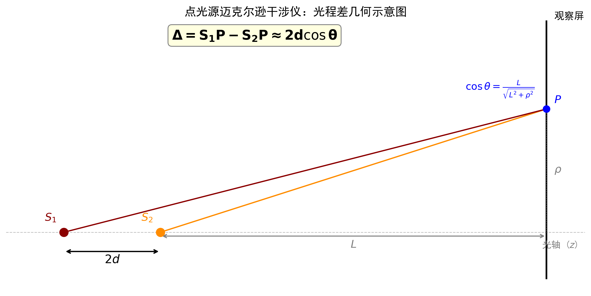
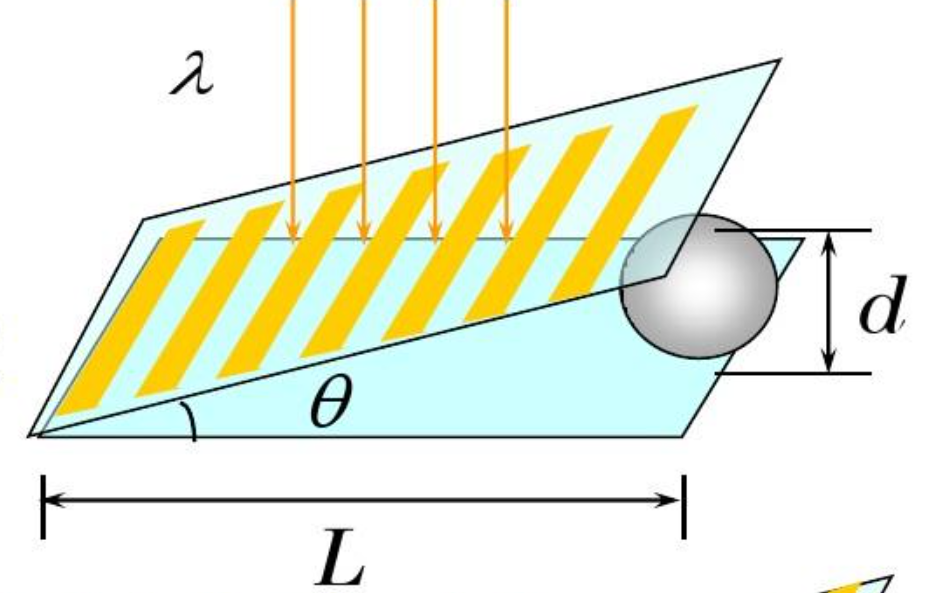

# 迈克尔逊干涉仪测折射率实验探究

## 实验目的
1. 使用迈克尔逊干涉仪测量两种不同厚度与类型玻璃片的折射率。
2. 探究不同光源下插入玻璃片后，为恢复特定干涉条纹时动镜 M1 的移动方向与原因，并给出对应折射率计算公式。

## 实验仪器
迈克尔逊干涉仪、氦氖激光器、短焦距透镜、毛玻璃片、扩束镜、白光光源、观察屏。

**实验配置图**

```
         M₁（可移动镜，上方垂直臂末端）
          ↑
        [玻璃板] 厚度 d，折射率 n
          ↑
      S → G₁—G₂ ——————→ M₂（固定镜，右侧水平臂末端）
          |
          ↓
         E（观察屏）
```

| 元件 | 位置 | 说明 |
|------|------|------|
| M₁ | 上方垂直臂末端 | **可移动镜**，沿垂直方向上下移动 |
| M₂ | 右侧水平臂末端 | **固定镜**，位置不变 |
| G₁ | 左侧 45° 平板 | **分光板**，半透半反 |
| G₂ | 右侧 45° 平板 | **补偿板**，材质厚度同 G₁ |
| 红光玻璃板 | 垂直臂中，M₁ 正下方 | 待测样品，厚度 7 mm，折射率 $n$ |
| 白光玻璃板 | 垂直臂中，M₁ 正下方 | 待测样品，厚度 0.3 mm，折射率 $n$ |

## 实验操作和实验现象
### 1. 红色激光实验
1. 光源与准直：开启氦氖激光，光束通过扩束镜，形成近似点光源与发散光束。
2. 条纹调出：微调 M1 与 M2 的角度，使观察屏上出现同心圆环条纹。
3. 参考状态记录：在不插入玻璃板时，调整M1位置使圆环逐渐过渡为平行直条纹。记录该位置为参考读数。
4. 插入厚玻璃板：在 M1 臂中垂直插入厚玻璃板，保持玻璃板面与光束基本垂直。
5. 条纹变化观察：条纹重新变成同心圆环条纹。
6. 补偿调整：沿 M1 移动方向微调，使平行条纹重新出现且清晰，记录新的 M1 位置读数。

**观测现象：**
插入玻璃板后，条纹重新变成同心圆环条纹；将 M1 向远离分光板方向移动，可重新找到清晰平行条纹。

### 2. 白色光源实验
1. 光源切换：更换为白光光源，加入毛玻璃片以形成扩展光源，并适当调整对准使光束进入干涉仪。
2. 条纹寻迹：缓慢移动 M1，在视场中寻找中心彩色条纹，并使其清晰可辨。
3. 参考状态记录：确认条纹最清晰时的 M1 位置，记录为参考读数。
4. 插入薄玻璃片：在 M1 臂中垂直插入薄玻璃片。
5. 条纹变化观察：彩色条纹迅速消失。
6. 补偿调整：缓慢将 M1 向靠近分光板方向移动，直至彩色条纹重新出现并达到最佳清晰度，记录新的 M1 读数。

**观测现象：**
插入玻璃片后彩色条纹会消失；通过将 M1 向靠近分光板方向移动，可重新找到清晰彩色平行条纹。

## 数据记录

### 1. He-Ne 激光（单色光）等厚干涉测量数据

| 测量次数 | 无玻璃片初始读数 d₀ (mm) | 有玻璃片补偿后读数 d₁ (mm) | 位移差 Δᵢ (mm) |
|----------|-----------------------------|-------------------------------|-----------------|
| 1        | 54.32107                    | 57.11739                      | 2.79632         |
| 2        | 54.28965                    | 57.09380                      | 2.80415         |
| 3        | 54.35782                    | 57.14769                      | 2.78987         |
| 平均值   | ——                          | ——                            | 2.79678         |

表格 1. He-Ne 激光（单色光）等厚干涉测量数据

### 2. 白光等厚干涉测量数据结果

| 测量次数 | 无玻璃片初始读数 d₀ (mm) | 有玻璃片补偿后读数 d₁ (mm) | 位移差 Δᵢ (mm) |
|------|------:|------:|------:|
| 1 | 51.94480 | 51.77279 | 0.17201 |
| 2 | 51.93326 | 51.76271 | 0.17055 |
| 3 | 51.95813 | 51.78424 | 0.17389 |
| 平均值 | 51.94540 | 51.77325 | 0.17215 |

表格 2. 白光等厚干涉测量数据结果


## 原理探究
两种操作方向完全相反的现象看似矛盾，实则是不同光源对干涉条件的"选择性"不同所致。关键在于：干涉条纹的形态（圆环或平直）由光程差随角度的变化率 $\partial\Delta/\partial\theta$ 决定，而绝对光程差的大小只影响亮暗。激光的相干长度极长，对恒定光程偏移不敏感——条纹形态只响应于两虚光源的几何间距 $h$。白光则相反，其极短的相干长度要求绝对零光程差。以下分别展开。

### 1. 红色激光实验：条纹形态只取决于虚像几何，与绝对光程差无关

**核心先导：一个必须区分的概念——光程差本身，还是光程差随角度的变化？**

理解本实验的关键在于明确两个截然不同的物理量：

- **光程差 $\Delta$ 本身**：决定屏上某一点的亮暗（干涉级次）。
- **光程差随角度的变化率 $\partial\Delta/\partial\theta$**：决定条纹的整体**形态**。若 $\partial\Delta/\partial\theta = 0$（$\Delta$ 对所有 $\theta$ 均相同），则光程差在全屏均匀，此时须借助两镜面间的微小夹角（劈尖）方能产生平直条纹；若 $\partial\Delta/\partial\theta \neq 0$，则为同心圆环——同一 $\theta$ 的圆上所有点 $\Delta$ 相同，形成等倾圆环。

这一区分贯穿全节，也是理解"为何激光实验条纹形态与绝对光程差无关"的钥匙。

---

**（1）两虚点光源模型：从 $h$ 推导出形态判据**

迈克尔逊干涉仪中，经分光板 G1 分光后，同一光源在 M1 与 M2 后各形成一个虚点光源 S₁、S₂，两者沿光轴方向相距 $2h$（$h$ 为动镜 M1 与定镜虚像 M2' 之间的间距）：

```
    S₁ (虚光源₁)          S₂ (虚光源₂)          观察屏
    ● ───── 2h ───── ● ──────── L ──────── █
                                            │
                                            · P (ρ)
                                            ↓ θ
```
<center></center>

观察屏距 S₂ 为 $L$（$L \gg 2h$），屏上一点 $P$ 到轴距离为 $\rho$，视角 $\theta$ 满足 $\cos\theta = L/\sqrt{L^2+\rho^2}$。两束光的光程差精确为：

$$
\Delta(\theta) = \sqrt{(L+2h)^2 + \rho^2} - \sqrt{L^2 + \rho^2}
$$

将分子有理化，即分子分母同乘共轭式 $\sqrt{(L+2h)^2+\rho^2} + \sqrt{L^2+\rho^2}$：

$$
\begin{aligned}
\Delta(\theta) &= \frac{\bigl[(L+2h)^2+\rho^2\bigr] - \bigl[L^2+\rho^2\bigr]}
{\sqrt{(L+2h)^2+\rho^2} + \sqrt{L^2+\rho^2}} \\[4pt]
&= \frac{4Lh + 4h^2}{\sqrt{(L+2h)^2+\rho^2} + \sqrt{L^2+\rho^2}}
\end{aligned}
$$

利用 $L \gg 2h$，分母中 $(L+2h)^2 \approx L^2$，故 $\sqrt{(L+2h)^2+\rho^2} \approx \sqrt{L^2+\rho^2}$，从而分母近似为：

$$
\sqrt{(L+2h)^2+\rho^2} + \sqrt{L^2+\rho^2} \approx 2\sqrt{L^2+\rho^2}
$$

同时分子中 $4h^2$ 项可略去，代入得：

$$
\Delta(\theta) \approx \frac{4Lh}{2\sqrt{L^2+\rho^2}}
        = 2h \cdot \frac{L}{\sqrt{L^2+\rho^2}}
        = 2h \cos\theta
$$

即得核心公式：

$$
\boxed{\Delta(\theta) \approx 2h \cos\theta}
$$

总光程差由两部分构成——**两虚点光源间距贡献**与**劈尖附加贡献**：

$$
\Delta_{\text{总}}(\theta) \approx 2h\cos\theta + 2x\alpha
$$

其中 $2x\alpha$ 为两镜面间微小夹角 $\alpha$ 在偏离中心 $x$ 处的附加光程差。在 $h \to 0$ 时，$\Delta_{\text{总}} \approx 2x\alpha$，平直条纹完全由劈尖角主导（等厚干涉）。

现在考察其角度依赖性：

- **$h$ 较大时**：$\partial\Delta/\partial\theta = -2h\sin\theta \neq 0$，光程差随 $\theta$ 变化，同一 $\theta$ 的圆上 $\Delta$ 相同 → **同心圆环**（等倾干涉），中心 $\theta=0$ 处 $\Delta=2h$ 最大，向外递减。
- **$h \to 0$ 时**：$\partial\Delta/\partial\theta = 0$，光程差对所有 $\theta$ 均相同，发散角的影响被彻底消除。此时若两镜面间存在微小夹角（劈尖），则在偏离中心 $x$ 处产生附加光程差 $2x\alpha$（$\alpha$ 为劈尖角）→ **平直条纹**（等厚干涉）。


结论很清楚：**条纹是圆环还是平直，唯一取决于 $h$ 是否为零，与绝对光程差的大小毫无关系。** 实验中用红光调出平直条纹，实质上是将 M1 调到 $h=0$——两虚光源在空间上重合。

**（2）插入玻璃后：固定光程偏移被"无视"，虚像位移才是关键**

在未插玻璃时 $h=0$，虚像重合与光程相等两个条件自然同时满足。垂直插入厚度 $d$、折射率 $n$ 的厚玻璃板后，玻璃对光同时产生两种效应，必须分开审视：

| 效应 | 机制 | 对 $\Delta(\theta)$ 的影响 | 对 $\partial\Delta/\partial\theta$ 的影响 |
|------|------|:---:|:---:|
| 减速效应 | 光在玻璃中速度变慢 | 追加**固定偏移** $2d(n-1)$ | **为零**（常数求导） |
| 视深效应 | 折射使 M1 虚像位置前移 |  $h增加\Delta x' = d\left(1-\frac{1}{n}\right)$ | **非零**（$h\neq0$） |

这正是理解整个实验的核心：**玻璃引入的固定光程偏移 $2d(n-1)$ 对所有 $\theta$ 都相同，对 $\partial\Delta/\partial\theta$ 毫无贡献，因此不改变条纹形态。** 激光的相干长度长达数十厘米，这个固定偏移完全在其容忍范围内——即便绝对光程差已远非零，激光仍能保持清晰干涉。

视深效应影响：根据几何光学，等效光源S1发出的光线经会被折射，由出射光光路反向延长形成的虚像会向观察者方向（分光板 G1 方向）跃迁前移：


$$
\Delta x' = d\left(1-\frac{1}{n}\right)
$$
此时
$$
\Delta_{\text{总}}(\theta) \approx \Delta x'\cos\theta + 2x\alpha-2d(n-1)
$$

这直接破坏了 $h=0$ 的条件——两虚光源在几何上重新分离，$\partial\Delta/\partial\theta$ 不再为零，条纹从平直退化为同心圆环。这就是激光实验中条纹形态对 $h$ 敏感、对固定光程偏移不敏感的自然体现：**固定光程偏移改变不了条纹形态，虚像位移才是决定形态的唯一因素。**

**（3）补偿逻辑：只补偿虚像位移，无视光程偏移**

既然条纹形态只取决于 $h$，要恢复平直条纹只需让 $h$ 重新归零。加玻璃使 M1 的虚像前移了 $\Delta x'$，因此在物理空间中把 M1 **向后（远离分光板方向）移动同样的距离** $\Delta x$，让 M1 的真实位置后退以抵消视深效应带来的虚像前移：

$$
\Delta x = \Delta x' = d\left(1-\frac{1}{n}\right)
$$

注意这个移动**完全不涉及对固定光程偏移 $2d(n-1)$ 的补偿**——激光的相干长度远大于该偏移量，因此对其毫不敏感。此时条纹形状取决于$\partial\Delta/\partial x =\alpha$,与减速效应造成的2d(n-1)依旧无关。M1 后退的距离 $\Delta x$ 纯粹是为了让虚像在几何上退回 $h=0$。整理即得折射率公式：

$$
n = \frac{d}{d-\Delta x}
$$

### 2. 白色光源实验：寻找零相位延迟的"光程差"补偿与"靠近"操作

**（1）极短相干性构成的"光程极零"强制约**

插玻璃对光束同样同时产生减速效应与视深效应，但白光属宽频带复色光，各色波长干涉条纹相互错位中和，相干长度仅微米量级。激光"先有条纹、再讨论形态"——对改变形态的视深效应敏感；白光则相反：若 OPD 不近零，视场中根本不存在任何条纹，讨论形态无从谈起。因此白光不受视深效应影响——并非它不发生，而是 OPD ≈ 0 这一压倒性硬约束直接决定了补偿方向：只有当各色条纹在视场中心同相位叠加，即 **$OPD \approx 0$** 时，才能在中心区域观察到少量彩色干涉条纹。

**（2）插入玻片引发的单向光程延长**
在 M1 臂中插入厚度 $d$ 的薄玻璃片后，光束在介质内的传播速度减慢。与同等厚度的空气层（$n_0 \approx 1$）相比，光在玻璃（$n>1$）中的单程光程增量为：
$$
\Delta_{\text{单程}} = nd - d = d(n-1)
$$
光束两次穿过该玻璃片（射入并经动镜反射折返），故该臂的总光程跳变为：
$$
\Delta(\text{OPD}) = 2d(n-1)
$$
这一跳变远超白光的相干长度，使原有的彩色条纹迅速消失。

**（3）补偿动作与折射率推导**
要使 $OPD$ 重新归零以重现彩色条纹，须在物理上缩短该臂的光程。将 M1 **向分光板方向推进（即靠近）**，在空气段消去冗余距离。设移动距离为 $\Delta x$，对应的物理光程减少量为 $2\Delta x$，由光程补偿守恒条件得：

$$
2\Delta x = 2d(n-1)
$$

化简即得折射率公式：

$$
n = 1 + \frac{\Delta x}{d}
$$

该结论与低相干光源"零光程差"条件一致，也与白光彩条仅在 $OPD \approx 0$ 附近出现的事实相符。
需要指出的是，白光补偿仅恢复了 $OPD \approx 0$，并未同时使两虚光源的间距 $h$ 归零。残留 $h = \Delta x - d(1-1/n) = d(n-2+1/n)$，对 $d=0.3$ mm、$n\approx 1.57$ 约为 0.06 mm。此残留间距使 $\Delta(\theta)$ 随 $\theta$ 变化极为缓慢——视场内的光程差变化不足半个波长——因此条纹曲率极小，在劈尖角的主导下呈现近似平行的彩色外观。这一细节不影响折射率推导的准确性。

---

**两种原理在实验设计上的呼应：厚玻璃与薄玻璃的选择**

一个值得注意的细节是：激光实验中待测玻璃板厚达 7 mm，而白光实验中仅 0.3 mm。这个差异并非偶然，而是两种原理在实验设计上的必然体现。

假设玻璃折射率约为 $n \approx 1.5$，分别估算两种实验中的关键测量量：

- **激光实验**：测量虚像位移 $\Delta x' = d(1 - 1/n) = 7 \times (1 - 1/1.5) \approx 2.33 \text{ mm}$。千分尺上 2 mm 量级的位移易于精确读取。玻璃越厚，信号越大，且激光不在乎相伴的固定光程偏移——**厚玻璃在激光实验中纯属优势。**

- **白光实验**：测量光程跳变 $2d(n-1) = 2 \times 0.3 \times 0.5 = 0.3 \text{ mm}$，对应的 M1 补偿位移约为 0.15 mm，仍在可追踪范围内。若也使用 7 mm 厚玻璃，OPD 跳变将达 7 mm 量级——远超白光微米级相干长度，实验上几乎不可能在如此大的行程中重新捕捉到彩色条纹。**白光实验的玻璃必须薄到让 OPD 跳变不超出可操作范围。**

因此，两种实验的玻璃厚度选择恰好是各自原理的物理约束的镜像：激光实验希望越厚越好（信号大、无代价），白光实验必须控制厚度（信号必须小于可追踪上限）。这一设计上的差异进一步佐证了两种原理的本质不同。

## 数据处理

本节根据三次测量数据分别计算红光实验和白光实验的折射率，并用重复测量的标准差估计不确定度。由于题目未给出玻璃厚度测量误差，这里先忽略厚度 $d$ 的不确定度，只考虑位移差 $\Delta x$ 的A类不确定度。

### 1. 红色激光实验的数据处理

红光实验中，厚玻璃板厚度取 $d = 7.0\,\text{mm}$，三次位移差测量值为：

$$
\Delta x_1 = 2.79632\,\text{mm},\quad
\Delta x_2 = 2.80415\,\text{mm},\quad
\Delta x_3 = 2.78987\,\text{mm}
$$

其平均值为：

$$
\bar{\Delta x} = \frac{\Delta x_1+\Delta x_2+\Delta x_3}{3} = 2.79678\,\text{mm}
$$

样本标准差为：

$$
s_{\Delta x} = \sqrt{\frac{\sum(\Delta x_i-\bar{\Delta x})^2}{n-1}} \approx 0.00716\,\text{mm}
$$

平均值的A类标准不确定度为：

$$
u(\bar{\Delta x}) = \frac{s_{\Delta x}}{\sqrt{3}} \approx 0.00413\,\text{mm}
$$

由红光折射率公式 $n = \dfrac{d}{d-\Delta x}$ 得：

$$
n_{\text{红}} = \frac{7.0}{7.0-2.79678} \approx 1.6655
$$

不确定度传播公式为：

$$
u(n) = \left|\frac{\partial n}{\partial \Delta x}\right|u(\bar{\Delta x}) = \frac{d}{(d-\bar{\Delta x})^2}u(\bar{\Delta x})
$$

代入数值得：

$$
u(n_{\text{红}}) \approx \frac{7.0}{(7.0-2.79678)^2}\times 0.00413 \approx 0.0016
$$

因此红光实验结果可写为：

$$
n_{\text{红}} = 1.6655 \pm 0.0016
$$

### 2. 白色光源实验的数据处理

白光实验中，薄玻璃片厚度取 $d = 0.3\,\text{mm}$，三次位移差测量值为：

$$
\Delta x_1 = 0.17201\,\text{mm},\quad
\Delta x_2 = 0.17055\,\text{mm},\quad
\Delta x_3 = 0.17389\,\text{mm}
$$

平均值为：

$$
\bar{\Delta x} = \frac{\Delta x_1+\Delta x_2+\Delta x_3}{3} = 0.17215\,\text{mm}
$$

样本标准差为：

$$
s_{\Delta x} \approx 0.00168\,\text{mm}
$$

平均值的A类标准不确定度为：

$$
u(\bar{\Delta x}) = \frac{s_{\Delta x}}{\sqrt{3}} \approx 0.00097\,\text{mm}
$$

由白光折射率公式 $n = 1 + \dfrac{\Delta x}{d}$ 得：

$$
n_{\text{白}} = 1 + \frac{0.17215}{0.3} \approx 1.5738
$$

其不确定度为：

$$
u(n) = \frac{u(\bar{\Delta x})}{d} \approx \frac{0.00097}{0.3} \approx 0.0032
$$

因此白光实验结果可写为：

$$
n_{\text{白}} = 1.5738 \pm 0.0032
$$

白光实验通过 0.3 mm 厚的玻璃片测得的折射率与红光实验的 $n_{\text{红}} \approx 1.666$ 略有差异，这可能是两块玻璃材质不同所致，也包含了两种测量原理各自的系统误差。尽管如此，修正后的数据 $n_{\text{白}} \approx 1.57$ 落在普通玻璃的合理范围内。

## 误差分析

### 1. 红色激光实验的主要误差来源

- **条纹判断误差**：红光调回平直条纹时，平直程度往往依赖操作者主观判断，容易把"接近平直"当作"完全平直"，从而带来位移读数偏差。
- **千分尺读数误差**：M1 位移需要在条纹变化过程中反复微调，若读数时存在回差或视差，会直接影响 $\Delta x$ 的平均值。
- **玻璃板放置偏差**：若厚玻璃板未严格保持垂直入射，虚像位移不再只由厚度决定，会引入额外的系统偏差。
- **厚度测量误差**：若玻璃厚度 $d$ 本身存在偏差，折射率结果会按 $n = d/(d-\Delta x)$ 被放大或缩小。

### 2. 白色光源实验的主要误差来源

- **相干条件更苛刻**：白光条纹只在极窄的 $OPD \approx 0$ 区域出现，条纹消失与重现的判定更敏感，因此补偿位置更容易受主观判断影响。
- **光源与对准不稳定**：白光实验依赖扩展光源和精确对准，稍有偏差就可能导致彩色条纹不清晰，从而影响 M1 的最终停点。
- **薄玻璃片厚度偏差**：白光实验中 $d = 0.3\,\text{mm}$ 较小，厚度标称值与实际值的微小偏差会按 $n = 1 + \Delta x/d$ 被显著放大。例如 $d$ 偏差 0.02 mm 即可导致 $n$ 变化约 0.1。
- **数据整体一致性**：修正后白光结果 $n_{\text{白}} \approx 1.574$ 与红光结果 $n_{\text{红}} \approx 1.666$ 量级相符，差异主要来自两块玻璃材质不同，也反映了两种测量原理各自的系统误差。若后续使用同一块玻璃进行两种实验，可进一步相互校验。

### 3. 对结果的总体判断

红光实验得到 $n_{\text{红}} = 1.6655 \pm 0.0016$，白光实验修正后得到 $n_{\text{白}} = 1.5738 \pm 0.0032$，两者均落在常见玻璃折射率范围内。微小的数值差异可能来源于两块玻璃材质不同，也可能来自两种原理各自引入的系统偏差。总体而言，两个实验从不同的物理机制出发，均得到了量级合理的结果，相互印证了两种补偿逻辑（远离 vs 靠近）的正确性。

## 结论
1. 红色激光实验中，插入厚玻璃板后需将 M1 远离分光板，以补偿视像位移并恢复等厚干涉的几何条件，折射率公式为 $n = \frac{d}{d-\Delta x}$。计算得 $n_{\text{红}} = 1.6655 \pm 0.0016$。
2. 白光实验中，插入薄玻璃片后需将 M1 向分光板方向移动，以补偿增加的光程差并回到 $OPD \approx 0$，折射率公式为 $n = 1 + \frac{\Delta x}{d}$。计算得 $n_{\text{白}} = 1.5738 \pm 0.0032$。
3. 两种操作方向的差异源于不同光源的相干长度：激光实验以几何成像条件（$\partial\Delta/\partial\theta$）为主，白光实验以零光程差（$OPD \approx 0$）为主。

参考资料（依据原理部分整理）：
- Born & Wolf, *Principles of Optics*, 7.5.4 节。
- Amrita Virtual Lab: Michelson's Interferometer — Refractive Index of Glass Plate。
- 潘峰《迈克耳孙干涉仪测平行玻片折射率的研究》（北邮物理实验室公开 PDF）。
